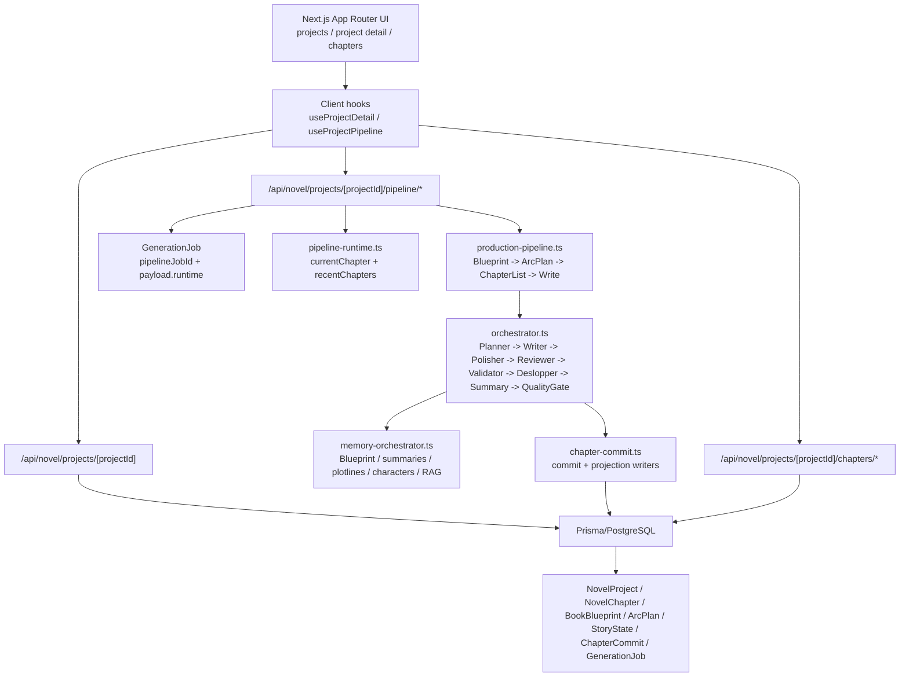

# DEV PROGRESS

更新时间：2026-06-01

## 1. 当前项目实际架构图

## 2. 当前已实现能力

- 项目创建、详情页、章节列表、章节编辑和章节审核抽屉已经存在。
- Book Blueprint、Arc Plan、Story Roadmap、Story State、World State 已有模型和部分自动初始化链路。
- 主生产流水线已经能从 `GenerationJob` 驱动，包含蓝图、阶段规划、章节目录、章节写作、摘要、提交、健康通知。
- 章节级 Agent 链路已经包含策划、写作、润色、对抗审稿、校验、去 AI 味、质量门禁、修复、摘要。
- 章节提交采用 `ChapterCommit` 和 projection writer，具备重放基础。
- 记忆系统已能组装 Blueprint、全书/卷/章节摘要、角色、伏笔、StoryState、RAG 上下文。
- 项目详情页已有 SSE + polling 的流水线状态刷新机制。
- 存在导出、灵感、市场分析、风格画像、RAG、反检测、封面等外围能力。
- 单元测试覆盖了工具函数、prompt、Agent 基础行为、章节提交、流水线 worker、工作流阶段等局部模块。

## 3. 当前最严重的 20 个问题

1. 运行态分散在 `NovelProject.status`、`workflowStage`、`GenerationJob.status`、`GenerationJob.currentStep`、`payload.runtime`、`NovelChapter.status`，页面需要自行拼状态。
2. 用户看到的阶段不是统一模型，蓝图、目录、写作、修复、导出 readiness 无法用同一套规则解释。
3. `ChapterStatus` 只有 `DRAFT/GENERATING/COMPLETED/REVIEWING`，无法表达 queued、failed、needs repair、skipped。
4. `ProjectStatus` 只有 `DRAFT/WRITING/COMPLETED/PAUSED`，无法表达 blueprinting、validating、repairing、failed 等真实生产阶段。
5. `/pipeline/status` 和 `/pipeline/stream` 重复实现运行态快照，字段计算逻辑容易漂移。
6. 旧 `/api/novel/engine/*` 与新 project pipeline 并存，用户路径和工程路径不完全统一。
7. `GenerationJob.totalChapters` 在项目总章数、当前批次章数之间语义混用。
8. `pipelineJobId` 在任务完成/取消时会清空，详情页只好回查 latest job，状态来源不稳定。
9. 心跳只依赖 `payload.runtime.lastEventAt`，蓝图/目录阶段的等待信息不够清晰。
10. 暂停只更新 job status，当前章节 runtime 和章节状态不一定同步。
11. 停止任务会把 job 标记为 `FAILED`，用户语义上更像取消/停止，容易误判为系统错误。
12. 质量门禁失败时章节会进入 `REVIEWING`，但运行态没有明确 `NEEDS_REPAIR`。
13. 项目详情页顶部按钮、下一步卡片、流水线控制面板、章节目录各自计算可操作性。
14. 章节列表只用数据库 chapter status，不能准确展示排队中、当前修复中、当前校验中。
15. 导出可用性没有统一规则，可能对未完成或待审稿章节给出过强暗示。
16. 初始化维护任务和正式生成任务是两套状态系统，用户会看到“初始化中”和“生成中”混杂。
17. 旧批量生成组件还存在独立生成参数和成本弹窗，和长篇导演流水线体验不一致。
18. README/PROJECT_ANALYSIS 声称能力很多，但部分是局部能力或旧入口，容易造成交付预期偏差。
19. 测试没有覆盖统一项目运行态、SSE 快照一致性、暂停/恢复/失败/修复状态映射。
20. 缺少面向主链路的端到端无 key fallback 验证，环境不可用时只能靠局部单测。

## 4. 当前主链路断点

- 创建小说后，自动初始化、蓝图确认、ArcPlan 确认、开始生成之间缺少统一状态条。
- 蓝图和 ArcPlan 已完成但未确认时，顶部按钮、下一步提示和侧栏状态不完全同源。
- 章节目录生成和章节正文生成都在流水线里，但状态只显示为 `CHAPTER_LIST` 或 `WRITE`，用户无法看出正在排队、策划还是修复。
- 批量生成完成后，`COMPLETED` 表示当前批次完成，不一定表示全书完成。
- 章节失败、待审稿、需要修复都被压到 `REVIEWING` 或 job `FAILED`，用户不知道下一步是审核、重试、恢复还是修复。
- 导出入口一直存在，缺少基于运行态的“可导出”判断。

## 5. 当前 UI/交互问题

- 详情页同时展示项目状态、工作流 badge、pipeline badge，语义重叠。
- 控制按钮的禁用规则分散在 `ProjectDetailClient` 和 `PipelineControlPanel`。
- 章节目录提示“点击章节可打开审核抽屉”，但没有把待修复/失败/当前写作阶段统一呈现。
- 侧栏的写作进度按字数计算，主面板按章节计算，两个进度口径不一致。
- 心跳卡住提示只在控制面板中出现，顶部/目录不知道任务可能卡住。
- `BatchGenerator`、单章生成页、production pipeline 三条生成入口体验不一致。

## 6. 当前数据模型问题

- `NovelProject.currentWordCount` 可被实时计算覆盖，但数据库字段仍存在，可能与章节实际字数漂移。
- `totalVolumes * 25` 被多处当作总章数，和 `resolveProjectPlanningTargets` 的有效总章数不完全一致。
- 运行时字段放在 `GenerationJob.payload.runtime`，没有 schema 级约束，只能靠 sanitizer。
- `GenerationJob.status` 没有 CANCELLED，取消被记录为 FAILED。
- `NovelChapter.status` 不足以承载工业化生产状态。
- `workflowStage` 是 string，未在 Prisma enum 层约束。

## 7. 当前 AI 生成链路问题

- 主链路已经有完整 Agent，但没有统一面向用户的阶段映射。
- 蓝图/ArcPlan/章节目录阶段缺少细粒度 progress event。
- `FAST_ACCEPTANCE` 会跳过重型校验，但 UI 只在完成后提示去 AI 味，不够前置。
- 质量门禁修复过程有内部事件，但项目级运行态没有 `REPAIRING` 或 `DESLOPPING` 明确阶段。
- 旧 engine API 生成 jobId 但不真正入队，容易与新的 project pipeline 混淆。

## 8. 当前测试覆盖缺口

- 缺少 `ProjectRuntimeSummary` 的状态推导单元测试。
- 缺少 `/pipeline/status` 与 `/pipeline/stream` 输出一致性测试。
- 缺少暂停、恢复、取消、失败、卡住任务的状态映射测试。
- 缺少章节状态到用户可见运行态的映射测试。
- E2E 只覆盖创建和门禁展示，尚未覆盖“开始生成 -> 进度 -> 审核 -> 导出”。
- AI key / 数据库不可用时的 fallback 行为没有系统验证。

## 9. 第一轮开发计划

目标：先统一项目运行态，不改数据库 schema，不碰真实部署。

- 新增 `ProjectRuntimeStage`、`ChapterRuntimeStatus`、`ProjectRuntimeSummary` 及纯函数推导逻辑。
- 统一 `/pipeline/status` 和 `/pipeline/stream` 的快照构建逻辑。
- 在项目详情 API 返回 `runtimeSummary`，让顶部、侧栏、控制面板和目录共用同一状态解释。
- 增加运行态单元测试，覆盖 idle、blueprinting、planning、writing、repairing、paused、failed、completed。
- 更新 DEV 文档记录决策和回滚点。

## 10. 第二轮开发计划

目标：把主链路从“能跑”升级为“可理解、可恢复、可验收”。

- 收敛旧生成入口，把单章生成、批量生成、production pipeline 的用户语言对齐。
- 为章节级状态补充 `NEEDS_REPAIR`、`FAILED` 的用户态映射，不急于迁移数据库 enum。
- 增加运行态驱动的导出 readiness 和修复入口。
- 为蓝图、ArcPlan、章节目录阶段补充更细进度事件。
- 增加无真实 AI key 的 mock/fallback 主链路测试。

## 11. 验收标准

- 项目详情页同一时刻只表达一个主要运行阶段，顶部、侧栏、控制面板、章节目录不冲突。
- `/api/novel/projects/[projectId]`、`/pipeline/status`、`/pipeline/stream` 对同一项目返回一致的运行态摘要。
- 用户能知道当前是蓝图中、规划目录中、写作中、校验中、修复中、暂停、失败还是完成。
- 用户能明确知道能否开始、暂停、继续、修复、导出。
- 没有新增生产环境配置、密钥或部署动作。
- 新增逻辑有单元测试，至少 `npm run test -- src/__tests__/unit/project-runtime.test.ts` 通过。
